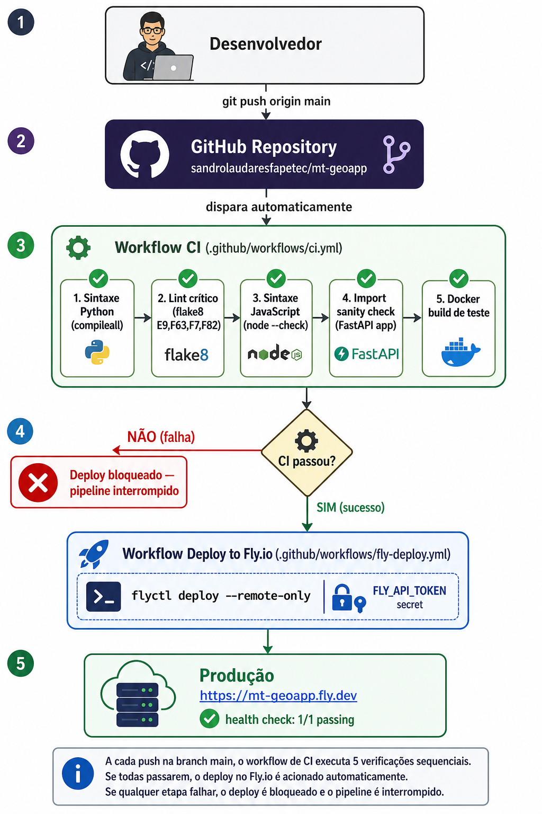

# Do código local ao deploy automático: guia didático do CI/CD do MT GeoApp

Este documento conta, passo a passo, como o projeto **MT GeoApp** saiu de uma pasta
local no computador até se tornar um repositório público no GitHub com **deploy
automático no Fly.io**, protegido por um pipeline de **Integração Contínua (CI)**
que verifica erros de sintaxe e lint antes de qualquer publicação.

Não é só um "o que fizemos" — é um "por quê fizemos assim", incluindo os erros reais
que encontramos e como foram corrigidos, para servir de referência caso o processo
precise ser repetido em outro projeto.

---

## Visão geral do fluxo final



Em texto corrido, o mesmo fluxo representado no diagrama acima:

```
 Você edita o código localmente
        │
        │ git push origin main
        ▼
┌───────────────────────┐
│   GitHub (repositório) │
└───────────┬────────────┘
            │ dispara automaticamente
            ▼
┌────────────────────────────┐
│  Workflow "CI"              │   Lint, sintaxe Python/JS,
│  (.github/workflows/ci.yml) │   import sanity check,
│                              │   build de teste do Docker
└───────────┬──────────────────┘
            │ se success
            ▼
┌────────────────────────────────┐
│  Workflow "Deploy to Fly.io"    │   flyctl deploy --remote-only
│  (.github/workflows/fly-deploy) │
└───────────┬──────────────────────┘
            │
            ▼
   https://mt-geoapp.fly.dev  (app em produção)
```

Ou seja: **nenhum código quebrado chega a ser deployado**. Se o CI falhar (erro de
sintaxe, import quebrado, Dockerfile não builda), o deploy simplesmente não é
disparado.

---

## Etapa 1 — Do zero ao primeiro commit

O projeto já existia como uma pasta de arquivos (`backend/`, `frontend/`,
`Dockerfile`, `fly.toml`) rodando localmente, mas **sem controle de versão** e
**sem estar em nenhum repositório remoto**.

### 1.1. Verificar se o repositório remoto já existia

Antes de criar nada, conferimos se `sandrolaudaresfapetec/mt-geoapp` já existia no
GitHub (e se estava vazio, para não sobrescrever nada por acidente):

```bash
curl -s "https://api.github.com/repos/sandrolaudaresfapetec/mt-geoapp"
curl -s "https://api.github.com/repos/sandrolaudaresfapetec/mt-geoapp/contents/"
# -> {"message": "This repository is empty."}
```

O repositório existia, era público, e estava vazio — ambiente limpo para o
primeiro push.

### 1.2. Autenticação: Personal Access Token (PAT)

Para enviar código a um repositório GitHub por HTTPS de forma não-interativa,
é preciso de credenciais. Usamos um **Personal Access Token (PAT)** — um
"token de acesso pessoal" que funciona como uma senha de uso programático, com
permissões específicas (no caso, escopo `repo` para leitura/escrita em
repositórios).

> 🔑 **Por que não usar a senha da conta diretamente?**
> O GitHub não aceita mais senha de conta para operações Git via HTTPS. O PAT é a
> alternativa oficial — e por ter escopo limitado e ser revogável a qualquer
> momento, é mais seguro.

O token foi gerado manualmente pelo usuário em
`https://github.com/settings/tokens/new`, marcando o escopo `repo`, e enviado
diretamente na conversa.

Validamos o token antes de usá-lo:

```bash
curl -s -H "Authorization: token $GITHUB_TOKEN" https://api.github.com/user
# -> confirma o login "sandrolaudaresfapetec"

curl -sI -H "Authorization: token $GITHUB_TOKEN" https://api.github.com/user \
  | grep -i x-oauth-scopes
# -> confirma que o escopo "repo" está presente
```

### 1.3. Preparar o repositório local: `.gitignore` e `README.md`

Antes do primeiro commit, criamos dois arquivos importantes:

**`.gitignore`** — evita subir lixo e segredos para o repositório:

```gitignore
__pycache__/
*.pyc
*.pyo
*.log
.env
*.env
.secrets/
.DS_Store
*.tiff
*.tif
venv/
.venv/
```

> ⚠️ **Por que isso é crítico?** As credenciais do Copernicus Data Space
> Ecosystem usadas nos testes ficaram guardadas em
> `/home/user/.secrets/copernicus.env`, **fora** da pasta do projeto — então
> nunca corriam risco de ir para o Git. Ainda assim, o `.gitignore` funciona como
> uma segunda camada de proteção contra qualquer `.env` que alguém deixe cair
> dentro do projeto no futuro.

**`README.md`** — documentação de entrada do projeto (arquitetura, estrutura de
pastas, como rodar localmente, como fazer deploy, lista de endpoints da API).

### 1.4. Limpar artefatos de execução antes do commit

Antes de rodar `git add`, removemos arquivos que são gerados automaticamente ao
executar o backend e não deveriam ir para o controle de versão:

```bash
rm -rf backend/__pycache__ backend/services/__pycache__ backend/server.log
```

### 1.5. Inicializar o Git e fazer o primeiro commit

```bash
git init -q
git config user.email "sandro@mtgeoapp.local"
git config user.name "Sandro Laudares"
git branch -m main            # garante que a branch principal se chama "main"

git add -A
git commit -m "Initial commit: MT GeoApp - Sentinel-2, CBERS-4A, DETER/PRODES, contexto socioambiental e relatorio PDF"
```

### 1.6. Conectar ao repositório remoto e enviar (`push`)

O token é embutido **temporariamente** na URL do remote apenas para autenticar o
push — e removido imediatamente depois, para não deixar credenciais em texto
plano na configuração do Git:

```bash
git remote add origin "https://${GITHUB_TOKEN}@github.com/sandrolaudaresfapetec/mt-geoapp.git"
git push -u origin main

# Depois do push, limpamos o token da URL do remote:
git remote set-url origin "https://github.com/sandrolaudaresfapetec/mt-geoapp.git"
```

> 💡 **Por que remover o token da URL depois?** Se alguém rodar `git remote -v`
> nesse ambiente depois, veria o token em texto plano. Removê-lo da URL do
> remote (mantendo só a URL pública) fecha essa brecha — o token continua
> funcionando para o próximo push porque ele fica no arquivo de segredos local,
> não precisa estar embutido na URL o tempo todo.

### 1.7. Confirmar que tudo chegou corretamente

Verificação final via API do GitHub (sem precisar nem entrar no navegador):

```bash
curl -s "https://api.github.com/repos/sandrolaudaresfapetec/mt-geoapp/contents/"
```

Resultado esperado: lista de arquivos e pastas (`backend/`, `frontend/`,
`Dockerfile`, `fly.toml`, `README.md`, `.gitignore`) — e nada de `.env` ou
`.secrets` na lista.

---

## Etapa 2 — Deploy automático no Fly.io via GitHub Actions

Com o código no GitHub, o próximo passo foi eliminar a necessidade de rodar
`flyctl deploy` manualmente a cada mudança. Para isso, usamos o
**GitHub Actions**: um sistema de automação embutido no GitHub que executa
scripts ("workflows") em resposta a eventos do repositório (like um `push`).

### 2.1. O problema de dar ao GitHub Actions acesso ao Fly.io

O comando `flyctl deploy` precisa de um **token de API do Fly.io** para saber em
qual conta e app fazer o deploy. Esse token não pode ficar hardcoded no código
nem visível no workflow — por isso o GitHub tem um sistema de **Secrets**:
valores criptografados que só são descriptografados durante a execução do
workflow, nunca aparecendo em logs nem no código-fonte.

### 2.2. Criptografando e enviando o secret via API

Diferente de simplesmente "copiar e colar" no site, o GitHub exige que qualquer
secret criado via API seja **criptografado no lado do cliente**, usando a chave
pública específica daquele repositório (`libsodium`, sealed box). O fluxo é:

```bash
# 1. Buscar a chave pública do repositório
curl -s -H "Authorization: token $GITHUB_TOKEN" \
  "https://api.github.com/repos/sandrolaudaresfapetec/mt-geoapp/actions/secrets/public-key"
# -> {"key_id": "...", "key": "<base64>"}
```

```python
# 2. Criptografar o valor do token do Fly.io com essa chave pública
from nacl import encoding, public
import base64

public_key = public.PublicKey(pubkey_b64, encoding.Base64Encoder())
sealed_box = public.SealedBox(public_key)
encrypted = sealed_box.encrypt(token_value.encode("utf-8"))
encrypted_b64 = base64.b64encode(encrypted).decode("utf-8")
```

```bash
# 3. Enviar o valor criptografado para o GitHub
curl -X PUT -H "Authorization: token $GITHUB_TOKEN" \
  "https://api.github.com/repos/sandrolaudaresfapetec/mt-geoapp/actions/secrets/FLY_API_TOKEN" \
  -d '{"encrypted_value": "...", "key_id": "..."}'
```

### 2.3. 🐛 Bug real: aspas capturadas junto no token

Na primeira tentativa, o deploy automático **falhou** com o erro
`token validation error`. Investigando, descobrimos a causa: o token do Fly.io
estava guardado localmente assim:

```bash
export FLY_API_TOKEN='FlyV1 fm2_lJPECAAA...'
```

E o script de extração fazia um `split("=", 1)` simples, capturando **as aspas
simples junto** com o valor (`'FlyV1 fm2_...'` em vez de `FlyV1 fm2_...`). O
token "criptografado e enviado" tinha 653 caracteres, mas o token real tinha 651
— dois caracteres de aspas sobrando, suficientes para invalidar toda a
autenticação.

**Correção aplicada:**

```python
token_value = line.split("=", 1)[1].strip()
# remove aspas simples ou duplas que envolvam o valor, se existirem
if len(token_value) >= 2 and token_value[0] in "'\"" and token_value[-1] == token_value[0]:
    token_value = token_value[1:-1]
```

> 📚 **Lição:** ao extrair valores de arquivos `.env` escritos à mão (ou por
> scripts diferentes), sempre verifique se sobrou aspas, espaços, ou `\n` no
> valor final antes de usá-lo — principalmente em fluxos de criptografia, onde
> um caractere extra invisível pode ser difícil de notar no log de erro.

Depois da correção, recriamos o secret (PUT sobrescreve o valor anterior) e
disparamos o workflow manualmente para confirmar:

```bash
curl -X POST -H "Authorization: token $GITHUB_TOKEN" \
  "https://api.github.com/repos/.../actions/workflows/fly-deploy.yml/dispatches" \
  -d '{"ref":"main"}'
```

Resultado: `status: completed`, `conclusion: success`.

### 2.4. O workflow de deploy (primeira versão)

```yaml
# .github/workflows/fly-deploy.yml (versão inicial)
name: Deploy to Fly.io

on:
  push:
    branches:
      - main
  workflow_dispatch: {}

concurrency:
  group: fly-deploy-${{ github.ref }}
  cancel-in-progress: true

jobs:
  deploy:
    runs-on: ubuntu-latest
    steps:
      - uses: actions/checkout@v4
      - uses: superfly/flyctl-actions/setup-flyctl@master
      - run: flyctl deploy --remote-only
        env:
          FLY_API_TOKEN: ${{ secrets.FLY_API_TOKEN }}
```

Pontos importantes:
- `on.push.branches: [main]` → dispara em todo push na branch principal.
- `workflow_dispatch: {}` → permite disparo manual pela aba Actions (ou via API),
  sem precisar de um novo commit.
- `concurrency` com `cancel-in-progress: true` → se um novo push chegar enquanto
  um deploy anterior ainda está rodando, o anterior é cancelado, evitando dois
  deploys concorrentes brigando pela mesma máquina no Fly.io.

Nessa primeira versão, o deploy disparava direto a cada push — sem nenhuma
verificação prévia de qualidade do código.

---

## Etapa 3 — Adicionando CI: pegando erros de sintaxe antes do deploy

Depois de validar que o deploy automático funcionava, o passo seguinte foi
**proteger o pipeline**: garantir que um erro de sintaxe ou uma falha de import
não chegasse a virar um deploy quebrado em produção.

### 3.1. Por que separar CI de Deploy em dois workflows?

Poderíamos colocar tudo em um único job ("lint → build → deploy"), mas separar
em dois workflows independentes (`ci.yml` e `fly-deploy.yml`) traz vantagens:

- **Reuso**: o CI roda em **qualquer branch** e em **pull requests**, mesmo que
  o deploy só aconteça na `main`. Isso dá feedback rápido em branches de
  desenvolvimento, antes mesmo de abrir um PR.
- **Clareza de responsabilidade**: "CI" verifica qualidade, "Deploy" publica.
  Cada um aparece separado na aba Actions, facilitando entender o que passou e
  o que falhou.
- **Encadeamento explícito**: o workflow de deploy passa a *depender* do
  resultado do CI via o evento `workflow_run`, em vez de reimplementar os mesmos
  checks dentro dele.

### 3.2. O que o CI verifica

```yaml
# .github/workflows/ci.yml
name: CI

on:
  push:
    branches:
      - '**'          # roda em QUALQUER branch
  pull_request:
    branches:
      - main
  workflow_dispatch: {}

jobs:
  lint-and-syntax:
    runs-on: ubuntu-latest
    steps:
      - uses: actions/checkout@v4

      - uses: actions/setup-python@v5
        with:
          python-version: '3.12'
          cache: 'pip'
          cache-dependency-path: backend/requirements.txt

      - run: pip install -r backend/requirements.txt

      # 1) Erros de sintaxe Python (arquivo não compila = erro grave)
      - run: python -m compileall -q backend

      - run: pip install flake8

      # 2) Erros críticos de lint: SyntaxError, uso de nome indefinido, etc.
      - run: flake8 backend --count --select=E9,F63,F7,F82 --show-source --statistics

      - uses: actions/setup-node@v4
        with:
          node-version: '20'

      # 3) Sintaxe do JavaScript do frontend
      - run: |
          for f in frontend/static/*.js; do
            node --check "$f"
          done

      # 4) O app FastAPI consegue de fato ser importado (pega erros de import,
      #    dependência faltante, erro de inicialização de módulo)
      - working-directory: backend
        run: python -c "import main; print('main.py imported OK, app =', main.app)"

  docker-build:
    runs-on: ubuntu-latest
    needs: lint-and-syntax     # só builda o Docker se o lint passar antes
    steps:
      - uses: actions/checkout@v4
      # 5) O Dockerfile builda de ponta a ponta, sem publicar a imagem
      - run: docker build -t mt-geoapp:ci-test .
```

Cada camada de verificação pega uma categoria diferente de erro:

| Check | O que pega | Exemplo de erro que teria sido detectado antes |
|---|---|---|
| `compileall` | Erros de sintaxe Python | Parêntese não fechado, indentação errada |
| `flake8 (E9,F63,F7,F82)` | Sintaxe + nomes indefinidos | Usar uma variável que não existe, `return` fora de função |
| `node --check` | Sintaxe JavaScript | Chave `{` sem fechar no `app.js` |
| Import sanity check | Módulo não importa | Faltou uma dependência no `requirements.txt`, erro de import circular |
| `docker build` | Dockerfile quebrado | Pacote de sistema faltando (foi exatamente o bug do `libexpat.so.1` que resolvemos antes!) |

> 🔎 **Conexão com um bug real anterior:** o próprio processo de deploy deste
> projeto já passou por uma falha em que o container reiniciava em loop porque
> faltava a biblioteca de sistema `libexpat1` (usada pelo `rasterio`/GDAL) na
> imagem Docker. Esse tipo de erro **só aparece em runtime**, não em
> `docker build` — por isso o CI aqui builda a imagem, mas o teste de saúde real
> continua sendo o health check pós-deploy (Etapa 4). O `docker build` no CI pega
> erros de **build** (ex: pacote não encontrado no `pip install`), não erros de
> **runtime** (ex: biblioteca de sistema faltando só percebida ao iniciar o
   processo).

### 3.3. Encadeando o deploy ao sucesso do CI

A versão final do workflow de deploy passou a usar o gatilho `workflow_run`:

```yaml
# .github/workflows/fly-deploy.yml (versão final)
name: Deploy to Fly.io

on:
  workflow_run:
    workflows: ["CI"]      # escuta o término do workflow chamado "CI"
    branches: [main]
    types: [completed]
  workflow_dispatch: {}

concurrency:
  group: fly-deploy-main
  cancel-in-progress: true

jobs:
  deploy:
    runs-on: ubuntu-latest
    # só deploya se foi disparo manual OU se o CI da main terminou com sucesso
    if: >-
      github.event_name == 'workflow_dispatch' ||
      github.event.workflow_run.conclusion == 'success'
    steps:
      - uses: actions/checkout@v4
        with:
          ref: main
      - uses: superfly/flyctl-actions/setup-flyctl@master
      - run: flyctl deploy --remote-only
        env:
          FLY_API_TOKEN: ${{ secrets.FLY_API_TOKEN }}
```

Pontos-chave dessa mudança:

- `on.workflow_run` faz este workflow "escutar" quando o workflow chamado `CI`
  termina (`types: [completed]`), em vez de escutar o `push` diretamente.
- A condição `if:` é a trava de segurança: mesmo que o `workflow_run` dispare
  (porque o CI rodou), o job só executa de fato se `conclusion == 'success'`.
  Se o CI falhar, este `if` bloqueia o job e o Fly.io nunca é tocado.
- `workflow_dispatch` continua disponível como válvula de escape manual — útil
  para redeployar sem precisar de um commit novo (por exemplo, se só a
  configuração do Fly.io mudou, não o código).

### 3.4. Validando antes de subir: nunca confiar às cegas num workflow novo

Antes de fazer commit dos workflows, validamos localmente cada verificação que
o CI ia rodar, para não descobrir problemas só depois de várias tentativas na
nuvem:

```bash
python3 -m compileall -q backend        # -> exit 0
flake8 backend --select=E9,F63,F7,F82   # -> exit 0, 0 erros
node --check frontend/static/app.js     # -> "app.js syntax OK"
cd backend && python3 -c "import main"  # -> "main.py imported OK"
```

E a sintaxe YAML dos próprios arquivos de workflow:

```bash
python3 -c "import yaml; yaml.safe_load(open('ci.yml'))"
python3 -c "import yaml; yaml.safe_load(open('fly-deploy.yml'))"
```

Só depois de tudo passar localmente é que fizemos o commit e push.

---

## Etapa 4 — Testando o pipeline completo de ponta a ponta

Com os dois workflows no lugar, testamos o fluxo real:

1. **Commit + push** do `ci.yml` e do `fly-deploy.yml` atualizado na branch
   `main`.
2. O GitHub disparou o workflow **CI** automaticamente (evento `push`).
3. Acompanhamos via API (`GET /actions/runs`) até `status: completed`,
   `conclusion: success`.
4. Assim que o CI terminou com sucesso, o GitHub automaticamente disparou o
   workflow **Deploy to Fly.io** (evento `workflow_run`), sem nenhuma ação
   manual nossa.
5. Acompanhamos o deploy até `conclusion: success`.
6. Confirmamos a saúde da aplicação em produção:

```bash
curl -s https://mt-geoapp.fly.dev/api/health
# -> {"status":"ok","time":"..."}

flyctl status --app mt-geoapp
# -> 1 total, 1 passing
```

### Linha do tempo real dessa validação

| Evento | Workflow | Resultado |
|---|---|---|
| `push` (código do CI/deploy) | CI | ✅ success (lint, sintaxe, import, docker build) |
| `workflow_run` (disparado pelo CI) | Deploy to Fly.io | ✅ success |
| Health check pós-deploy | — | `{"status":"ok"}`, máquina `1/1 passing` |

---

## Resumo do que cada peça faz (mapa mental)

```
Repositório GitHub (sandrolaudaresfapetec/mt-geoapp)
│
├── .gitignore              → impede que segredos/caches sejam versionados
├── README.md                → documentação de entrada do projeto
├── Dockerfile                → como o app é empacotado em imagem
├── fly.toml                  → configuração do app no Fly.io (nome, região, porta)
│
├── backend/                  → API FastAPI + serviços de integração
├── frontend/                 → HTML/JS/CSS servidos pela própria API
│
├── docs/
│   └── CI_CD.md              → este documento
│
└── .github/workflows/
    ├── ci.yml                → roda em toda branch/PR: lint, sintaxe, build de teste
    └── fly-deploy.yml        → dispara SÓ quando o CI da main passa: publica no Fly.io
```

**Secrets do repositório** (GitHub → Settings → Secrets and variables → Actions):

| Secret | Usado por | Para quê |
|---|---|---|
| `FLY_API_TOKEN` | `fly-deploy.yml` | Autenticar o `flyctl deploy` sem expor o token no código |

---

## Como operar o pipeline no dia a dia

- **Fazer uma alteração e publicar**: edite o código, `git commit`, `git push
  origin main`. O CI roda, e se passar, o deploy acontece sozinho.
- **Testar uma branch antes de mesclar**: crie uma branch (`git checkout -b
  minha-feature`), dê push nela — o CI roda automaticamente (porque
  `push.branches: ['**']`), mas o deploy **não** é acionado (porque ele só
  escuta CI da branch `main`).
- **Forçar um redeploy sem mudar código** (ex.: só quer reiniciar a máquina com
  a mesma imagem): vá na aba **Actions** do repositório → workflow
  "Deploy to Fly.io" → botão **Run workflow**.
- **Ver por que um deploy não aconteceu**: veja o resultado do workflow **CI**
  primeiro — se ele falhou, o deploy nunca chega a ser dessa disparado, por
  design.
- **Ver logs de qualquer execução**: aba **Actions** do repositório
  (`https://github.com/sandrolaudaresfapetec/mt-geoapp/actions`), clique na
  execução desejada.

---

## Erros reais encontrados neste processo (e a lição de cada um)

1. **Aspas capturadas ao extrair o token do Fly.io** → o secret criptografado
   ficou com 2 caracteres extras e invalidou toda a autenticação no primeiro
   deploy via Actions.
   *Lição: sempre normalizar (`strip()` + remover aspas) valores extraídos de
   arquivos `.env` escritos manualmente antes de os usar em fluxos
   automatizados.*

2. **Biblioteca de sistema faltando na imagem Docker** (`libexpat.so.1`, exigida
   pelo `rasterio`/GDAL) causou loop de restart em produção, mesmo com o build
   do Docker tendo sucesso. *Lição: `docker build` bem-sucedido não garante que
   o container vai **rodar** sem erro — dependências nativas de bibliotecas
   Python com bindings C (rasterio, GDAL, etc.) exigem pacotes de sistema
   explícitos no Dockerfile, e isso só aparece nos logs de runtime, não no
   build.*

3. **Rota HTTP errada em teste manual** (`/api/context/socioambiental` em vez
   de `/api/context/summary`) gerou um falso alarme de "endpoint quebrado".
   *Lição: sempre confirmar o nome exato das rotas registradas
   (`grep "@app\."`) antes de testar em produção, para não confundir erro de
   teste com bug real.*

4. **Camada externa (INPE/TerraBrasilis) instável**: a camada de Unidades de
   Conservação federais retornava erro 500 no próprio servidor do governo, não
   por culpa do nosso código. A correção não foi "tentar arrumar o servidor
   deles", e sim tornar nosso app **transparente** sobre a limitação (sinalizar
   "dados parciais" em vez de mostrar silenciosamente "0 resultados", o que
   poderia ser mal interpretado como "confirmado, não há UC na área").
   *Lição: ao depender de fontes de dados externas fora do seu controle, trate
   falhas parciais como informação de primeira classe na resposta, não como
   exceção silenciosa.*
